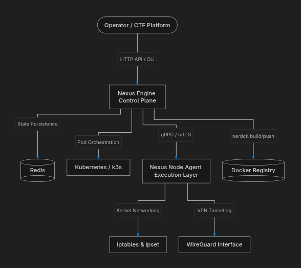

# Nexus Framework

> **A self-hosted, bare-metal CTF challenge orchestration platform.**  
> Deploy, isolate, and manage ephemeral hacking challenges on your own infrastructure — no cloud required.

[](LICENSE)
[](https://golang.org)
[](https://www.rust-lang.org)

---

## Table of Contents

- [Overview](#overview)
- [Architecture](#architecture)
- [Components](#components)
- [Installation](#installation)
- [Configuration](#configuration)
- [CLI Reference](#cli-reference)
- [API Reference](#api-reference)
- [Uninstalling](#uninstalling)
- [Project Structure](#project-structure)
- [Development](#development)

---

## Overview

Nexus Framework is a control plane for running containerized CTF (Capture The Flag) challenges on bare-metal or self-hosted virtual machines. It replaces expensive cloud-based orchestration with a lightweight K3s + nerdctl stack, providing:

- **Multi-tenant isolation** via WireGuard VPN and `ipset`/`iptables` network policies
- **Ephemeral challenge instances** — each player session gets its own isolated container
- **Operator CLI** with a live TUI dashboard for monitoring sessions in real time
- **Plug-in registries** — interactive setup for Docker Hub, GHCR, AWS ECR, or Private/Custom registries
- **Automated Releases** — prebuilt binaries for amd64/arm64 with hybrid fallback installation
- **`dev` and `prod` modes** for local testing and hardened production deployments

---

## Architecture



---

## Components

| Component | Language | Role |
|---|---|---|
| **nexus-engine** | Go (Gin) | Central REST API, session lifecycle, K3s reconciliation |
| **nexus-cli** | Go (Cobra + Bubbletea) | Operator CLI and live TUI dashboard |
| **nexus-node-agent** | Rust (Tonic/gRPC) | Privileged daemon — manages `ipset`, `iptables`, WireGuard |
| **nexus-installer** | Go (Bubbletea TUI) | Interactive full-screen setup wizard |

### nexus-engine
The core API server. It manages the full challenge session lifecycle:
- Creates/destroys K3s pods for each player session
- Tracks session state in Redis (TTL-based cleanup)
- Communicates with `nexus-node-agent` via gRPC for network configuration
- Exposes a REST API consumed by the CLI and external platforms (e.g., CTFd)

### nexus-cli
The operator control surface. Provides:
- `nexus tui` — a live, updating terminal dashboard for session monitoring
- `nexus challenge` — create, list, and delete challenge definitions
- `nexus session` — inspect and terminate player sessions
- `nexus status` — health check against the engine
- `nexus config` — view and validate the local configuration

### nexus-node-agent
A privileged Rust daemon that runs alongside the engine on each node. It handles all kernel-level network operations that require `CAP_NET_ADMIN`:
- WireGuard peer management for VPN-based isolation
- `ipset`/`iptables` rule enforcement per session
- Accepts commands from `nexus-engine` via an insecure gRPC socket (local only)

### nexus-installer
A full-screen TUI installer written in Go using Bubbletea. Replaces the legacy `deploy/setup.sh` with an interactive, distro-aware setup experience that handles the complete 9-phase bootstrap automatically.

---

> **Binary Distribution**: Prebuilt binaries are available for `amd64` and `arm64`. The installer automatically downloads and verifies these, falling back to local compilation only if necessary.

> **SELinux Note (Fedora/RHEL)**: The installer and engine automatically handle SELinux contexts for all managed binaries and services.

### Cloud / AWS Deployment (Required Firewall Rules)

When running Nexus on a cloud VM (AWS EC2, GCP, Azure, etc.) the following **inbound ports must be open** in your security group / firewall. These are permanent requirements — not one-time setup:

| Port | Protocol | Required For | Scope |
|------|----------|-------------|-------|
| **8081** | TCP | Nexus Engine REST API (CLI, CTF platform) | Your IP or `0.0.0.0/0` |
| **51820** | **UDP** | **WireGuard VPN — student tunnel handshake** | `0.0.0.0/0` |
| **5000** | TCP | Container Registry (if using local registry) | `127.0.0.1` only (internal) |
| **50051** | TCP | Node Agent gRPC (localhost only — do not expose) | `127.0.0.1` only |
| **3000** | TCP | CTF Platform Frontend (if deployed) | Your IP or `0.0.0.0/0` |
| **4000** | TCP | CTF Platform Backend (if deployed) | Your IP or `0.0.0.0/0` |

> [!IMPORTANT]
> **Port 51820/UDP is the most commonly missed rule.** Without it, WireGuard peers can never complete a handshake. Symptoms: `ping 10.8.0.1` 100% packet loss, `wg show wg0 latest-handshakes` shows `0` for all peers. Adding the inbound UDP rule is the fix.

> [!NOTE]
> **Port 50051 must NOT be publicly exposed.** The node agent accepts privileged gRPC commands (WireGuard peer management, iptables rules) and is designed for localhost-only communication with the engine via mTLS.

> [!NOTE]
> **Port 5000 (Registry)** is only needed if you're running a local container registry. If using GHCR, Docker Hub, or AWS ECR, this port is not required.

#### Cloud Provider Specific Instructions

**AWS EC2:**
1. Go to EC2 Console → Security Groups → Select your security group
2. Edit Inbound Rules → Add Rule
3. Add the ports listed above with appropriate sources

**GCP:**
1. Go to VPC Network → Firewall → Create Firewall Rule
2. Set targets to your instance tag
3. Add the ports as allowed protocols/ports

**Azure:**
1. Go to Virtual Machines → Networking → Inbound port rules
2. Add the required ports with appropriate sources

---

## Installation

### One-Command Bootstrap (Recommended)

Install Nexus Framework on any supported Linux distribution with a single command:

```bash
curl -fsSL https://gitlab.com/abhi-vmlinuz/nexus-framework/-/raw/main/bootstrap.sh | bash
```

This automatically detects and installs the **latest stable release**.

#### Channels

```bash
# Stable (default) — auto-detects latest release
curl -fsSL https://gitlab.com/abhi-vmlinuz/nexus-framework/-/raw/main/bootstrap.sh | bash

# Development builds — latest rolling dev snapshot
curl -fsSL https://gitlab.com/abhi-vmlinuz/nexus-framework/-/raw/main/bootstrap.sh | bash -s -- --dev

# Specific version
curl -fsSL https://gitlab.com/abhi-vmlinuz/nexus-framework/-/raw/main/bootstrap.sh | bash -s -- --tag v0.1.1-beta
```

| Flag | Description |
|---|---|
| (default) | Install latest stable release (auto-detected from GitLab releases) |
| `--stable` | Same as default — explicitly select stable channel |
| `--dev` | Install latest development build (rolling `latest-dev` tag) |
| `--tag <version>` | Install a specific release (e.g., `--tag v0.1.1-beta`) |
| `--help` | Show usage information |

> **Environment override**: `RELEASE_TAG=v0.1.1-beta` can be set to force a specific tag.

### Manual Installation

If you prefer to audit the code first or clone manually:

```bash
git clone https://gitlab.com/abhi-vmlinuz/nexus-framework.git
cd nexus-framework
chmod +x build-installer.sh
./build-installer.sh
```

### What the Installer Does (9 Phases)

| Phase | Description |
|---|---|
| 0 | Validate `sudo` credentials, initialize install log at `/var/log/nexus-install.log` |
| 1 | Detect distro, install system packages (`curl`, `jq`, `wireguard`, `golang`, `rust`, etc.) |
| 2 | Install K3s in standalone mode (Traefik disabled), create `nexus-challenges` namespace |
| 3 | Install `nerdctl` + containerd, configure the `nexus` group and socket permissions |
| 4 | Set up the container registry (local on `:5000` or authenticate with GHCR/Docker Hub) |
| 5 | Deploy Redis (Docker container or host service) |
| 6 | Configure WireGuard VPN server on `wg0` (`prod` mode only) |
| 7 | Download verified prebuilt binaries (Engine, CLI, Node Agent) with local build fallback |
| 8 | Write user config to `~/.config/nexus/config.json` and engine config to `/etc/nexus/engine.env` |
| 9 | Generate and enable systemd unit files, start all services |

### Supported Distributions

| Distro Family | Package Manager | Status |
|---|---|---|
| Debian / Ubuntu | `apt` | Tested |
| Fedora / RHEL / CentOS | `dnf` / `yum` | Tested |
| Arch Linux / Manjaro | `pacman` | ⚠️ Experimental |
| openSUSE | `zypper` | ⚠️ Experimental |

---


### Global Persistence

While user-specific settings are in your home directory, the **Nexus Engine** maintains its global state at:
- **Config Path**: `/etc/nexus/engine.env`
- **Permissions**: `0644`

This file is automatically synchronized when you use the `nexus config registry` or `nexus config set` commands.

### Runtime Configuration

Nexus supports "Soft Config" hot-reloading. Parameters like resource limits and session TTLs can be updated live without restarting the engine.

| Key | Description | Example |
|---|---|---|
| `challenge.cpu` | Default CPU cores for pods | `0.5`, `1.0`, `500m` |
| `challenge.memory` | Default RAM limit (requires suffix!) | `256Mi`, `1Gi` |
| `session.ttl` | Default session duration (minutes) | `60`, `120` |
| `session.max_per_user` | Concurrent sessions per player | `3`, `5` |

> [!IMPORTANT]
> **Memory Suffixes**: Always use `Mi` (Megabytes) or `Gi` (Gigabytes). Setting `challenge.memory` to a plain number like `512` assigns **512 bytes**, which will cause containers to crash immediately.

Use the CLI to apply these changes:
```bash
nexus config set challenge.cpu 0.5
nexus config set challenge.memory 512Mi
```
Changes are applied to future pods immediately and persisted to `/etc/nexus/engine.env`.

### Environment Variable Overrides

All configuration values can be overridden with environment variables:

| Variable | Default | Description |
|---|---|---|
| `NEXUS_MODE` | `dev` | `dev` or `prod` |
| `NEXUS_PORT` | `8081` | Engine listen port |
| `NEXUS_REDIS_URL` | `redis://localhost:6379` | Redis connection string |
| `NEXUS_REGISTRY_URL` | `localhost:5000` | Container registry URL |
| `NEXUS_NODE_AGENT_ADDR` | `localhost:50051` | Node agent gRPC address |
| `NEXUS_K3S_NAMESPACE` | `nexus-challenges` | Kubernetes namespace |
| `NEXUS_ENGINE_URL` | `http://localhost:8081` | Used by the CLI to reach the engine |
| `NEXUS_WG_ENDPOINT` | *(required in prod)* | Public IP:port for WireGuard, e.g. `10.X.X.X8:51820` |
| `NEXUS_API_KEY` | *(auto-generated)* | API authentication key (auto-generated during install) |
| `NEXUS_ALLOWED_BUILD_PATHS` | `/opt/nexus/challenges,/tmp` | Comma-separated list of allowed directories for Dockerfile/compose paths |
| `KUBECONFIG` | `/etc/rancher/k3s/k3s.yaml` | K3s kubeconfig path |

> [!NOTE]
> **Registry URL Default**: When `NEXUS_REGISTRY_URL` is empty or not set, the engine defaults to `localhost:5000` (the local registry installed by the Nexus installer). This is the recommended setup for most deployments. Only set this variable when using an external registry like GHCR, Docker Hub, or AWS ECR.

**Registry Configuration Examples:**

```bash
# Local registry (default — no configuration needed)
# The installer sets up a local registry on port 5000
# NEXUS_REGISTRY_URL can be left empty or unset

# GitHub Container Registry (GHCR)
NEXUS_REGISTRY_URL=ghcr.io/your-org
NEXUS_REGISTRY_AUTH_TYPE=ghcr
NEXUS_REGISTRY_AUTH_USERNAME=your-username
NEXUS_REGISTRY_AUTH_PASSWORD=ghp_xxxxxxxxxxxx

# Docker Hub
NEXUS_REGISTRY_URL=docker.io/your-org
NEXUS_REGISTRY_AUTH_TYPE=basic
NEXUS_REGISTRY_AUTH_USERNAME=your-username
NEXUS_REGISTRY_AUTH_PASSWORD=your-password

# AWS ECR
NEXUS_REGISTRY_URL=123456789012.dkr.ecr.us-east-1.amazonaws.com
NEXUS_REGISTRY_AUTH_TYPE=awsecr
NEXUS_REGISTRY_AUTH_AWS_ACCOUNT=123456789012
NEXUS_REGISTRY_AUTH_AWS_REGION=us-east-1
```

### Switching Registries at Runtime

You can switch between registries without restarting the engine:

**Via CLI (Interactive):**
```bash
nexus config registry
```
This walks through Docker Hub, GHCR, AWS ECR, or custom registry setup.

**Via API:**
```bash
# Switch to GHCR
curl -X PUT http://localhost:8081/api/v1/admin/registry \
  -H "Content-Type: application/json" \
  -d '{
    "url": "ghcr.io/your-org",
    "auth_type": "ghcr",
    "username": "your-username",
    "password": "ghp_xxxxxxxxxxxx"
  }'

# Switch to Docker Hub
curl -X PUT http://localhost:8081/api/v1/admin/registry \
  -H "Content-Type: application/json" \
  -d '{
    "url": "docker.io/your-org",
    "auth_type": "basic",
    "username": "your-username",
    "password": "your-password"
  }'

# Switch back to local registry
curl -X PUT http://localhost:8081/api/v1/admin/registry \
  -H "Content-Type: application/json" \
  -d '{
    "url": "localhost:5000",
    "auth_type": "local"
  }'
```

**What happens when you switch:**
1. Engine updates in-memory configuration
2. Persists to `/etc/nexus/engine.env`
3. Runs `nerdctl login` to authenticate with the new registry
4. Creates/updates K8s image pull secret (`nexus-pull-secret`)
5. All future `nerdctl build/pull/push` operations use the new registry

> [!NOTE]
> **Existing challenges** still reference images from the old registry. New challenges will use the new registry. To use existing challenges with the new registry, re-register them or update the image references.

### Modes

**`dev` mode** (default):
- WireGuard VPN is **disabled**
- Services run without strict network isolation
- Ideal for local development and testing

**`prod` mode**:
- WireGuard VPN is enabled on `wg0` (`10.8.0.1/24`, port `51820/UDP`)
- `ipset`/`iptables` rules are enforced per session
- Systemd services run with `CAP_NET_ADMIN` capabilities
- **Requires** `NEXUS_WG_ENDPOINT` env var set to `<public_ip>:51820`
- **Requires** inbound UDP 51820 open in your firewall/security group
- **Generated VPN configs are **split-tunnel** (`AllowedIPs = 10.8.0.0/24, 10.42.0.0/16` only) — internet traffic is NOT routed through the VPN, preserving normal connectivity for students while routing traffic destined for challenge pods (10.42.0.0/16) and management interface (10.8.0.0/24) through the VPN.

### API Key Authentication

The engine requires an API key for all endpoints except `/health` and `/metrics`. The key is set during installation and stored in `/etc/nexus/engine.env`.

```bash
# View current key
sudo grep NEXUS_API_KEY /etc/nexus/engine.env

# Set a new key
echo "NEXUS_API_KEY=$(openssl rand -hex 32)" | sudo tee -a /etc/nexus/engine.env
sudo systemctl restart nexus-engine
```

The CLI automatically reads the key from `~/.config/nexus/config.json`. To set it manually:

```bash
nexus config set engine.api_key <your-key>
```

If no key is configured, all endpoints are open (auth disabled).

---

## CLI Reference

Nexus Framework provides an operator CLI client (`nexus`) to monitor the engine, register challenges, control player sessions, and launch a live TUI terminal dashboard.

For a comprehensive guide detailing all command parameters, options, and TUI shortcuts, please refer to the **[CLI Reference Manual](docs/cli.md)**.

```
nexus [command]

Available Commands:
  tui         Open the live TUI dashboard
  status      Show engine health and cluster overview
  challenge   Manage CTF challenge definitions (register, list, delete, rebuild)
  session     Inspect and manage player sessions (create, list, get, terminate, extend)
  admin       Operator tasks (cluster health audit, manual reconcile trigger)
  config      View, initialize, validate, or set CLI and Engine configuration keys
  version     Print the version number of nexus-cli
  completion  Generate autocomplete scripts for your shell

Global Flags:
  --engine string   Override the Nexus engine URL (default: http://localhost:8081)
```

### Quick Examples

```bash
# Check engine and system health
nexus status

# Open the live terminal dashboard TUI
nexus tui

# Register a single-container challenge
nexus challenge register --name pwn-101 --dockerfile ./Dockerfile --ports 4444

# Register a multi-container challenge via docker-compose
nexus challenge register --name web-db --compose ./docker-compose.yml

# List all registered challenges
nexus challenge list

# Deployed sessions status overview
nexus session list

# Interactively configure Engine to link with Docker Hub/GHCR/ECR
nexus config registry
```

### Shell Completion

Nexus CLI supports tab-completion for Bash, Zsh, Fish, and PowerShell. To enable it for your current session:

```bash
# For Bash
source <(nexus completion bash)

# For Zsh
source <(nexus completion zsh)

# For Fish
nexus completion fish | source
```

To make it permanent, add the appropriate command to your shell's configuration file (e.g., `~/.bashrc` or `~/.zshrc`).

---

## API Reference

Nexus Framework provides a complete REST API for session lifecycle management and challenge orchestration. This allows for easy integration with existing CTF platforms like CTFd.

For a full list of endpoints, request models, and response structures, see the [API Documentation](docs/api.md).

### CTF Platform Integration

For developers building CTF platforms, see the **[CTF Integration Guide](docs/ctf-integration.md)** for:
- Complete integration flow
- Challenge registration (pre-built images or build from source)
- Session lifecycle management
- VPN configuration for students
- Environment variable handling
- Database schema for challenge packs
- Python code examples

**Quick Example (Create Session)**
```bash
curl -X POST http://localhost:8081/api/v1/sessions \
  -H "Content-Type: application/json" \
  -d '{
    "challenge_id": "pwn-101-abcd",
    "user_id": "player-1"
  }'
```

---

## Uninstalling

Run the uninstaller script to cleanly remove all Nexus components:

```bash
sudo ./deploy/uninstaller.sh
```

The uninstaller removes:
- **Systemd services**: `nexus-engine`, `nexus-node-agent`, `nexus-socket-fix`
- **Binaries**: `/usr/local/bin/nexus`, `/usr/local/bin/nexus-engine`, `/usr/local/bin/nexus-node-agent`
- **Configuration**: `~/.config/nexus/`
- **Containers**: `nexus-redis`, `nexus-registry` (via nerdctl)
- **WireGuard**: `wg0` interface and `/etc/wireguard/wg0.conf`

> **K3s and the `nexus-challenges` namespace are intentionally preserved** to protect any challenge data. The uninstaller will prompt you before removing them.

---

## Project Structure

```
nexus-framework/
├── build-installer.sh          # Bootstrap: build, run, and cleanup the installer
├── deploy/
│   ├── setup.sh                # Legacy bash installer (superseded by TUI)
│   ├── uninstaller.sh          # Full system cleanup script
│   ├── network-policy-dev.yaml # K3s network policy (dev)
│   └── network-policy-prod.yaml# K3s network policy (prod)
├── nexus-engine/               # Go — Core REST API server
│   ├── cmd/main.go             # Entry point
│   └── internal/
│       ├── api/                # Gin HTTP handlers
│       ├── controller/         # Session reconciliation loop
│       ├── k8s/                # K3s/Kubernetes client
│       ├── nodeagent/          # gRPC client for nexus-node-agent
│       ├── registry/           # Container registry interaction
│       ├── state/              # Redis state management
│       └── config/             # Environment-based configuration loader
├── nexus-cli/                  # Go — Operator CLI (Cobra + Bubbletea)
│   ├── main.go
│   ├── cmd/                    # Cobra subcommands
│   ├── client/                 # HTTP client for nexus-engine
│   ├── tui/                    # Live Bubbletea TUI dashboard
│   └── config/                 # Config loader with env fallback
├── nexus-node-agent/           # Rust — Privileged network daemon (Tonic gRPC)
│   ├── src/
│   │   ├── main.rs
│   │   ├── server.rs           # gRPC server implementation
│   │   ├── config.rs           # Config from environment
│   │   └── adapters/           # ipset, iptables, WireGuard adapters
│   └── Cargo.toml
├── nexus-installer/            # Go — Interactive TUI installer (Bubbletea)
│   ├── main.go                 # Bubbletea program entry + Update loop
│   ├── model.go                # Shared application state model
│   ├── pages.go                # TUI page renderers
│   ├── styles.go               # Lipgloss design system
│   └── internal/
│       ├── installer.go        # 9-phase installation logic
│       └── exec.go             # Shell command runner with logging
├── docs/
│   ├── architecture.md
│   ├── api.md
│   └── quickstart.md

```

---

## Development

### Building Individual Components

```bash
# Build nexus-engine
cd nexus-engine && go build -o nexus-engine ./cmd

# Build nexus-cli
cd nexus-cli && go build -o nexus .

# Build nexus-node-agent (Rust)
cd nexus-node-agent && cargo build --release

# Build nexus-installer TUI
cd nexus-installer && go build -o nexus-installer *.go
```

### Running in Dev Mode

```bash
# 1. Start Redis
nerdctl run -d --name nexus-redis -p 6379:6379 redis:7-alpine

# 2. Start the engine (dev mode uses defaults from config.json)
nexus-engine

# 3. In another terminal, verify
nexus status
nexus tui
```

### Smoke Test

After a fresh installation, run the bundled smoke test to verify all services are reachable:

```bash
chmod +x scripts/smoke_test.sh
./scripts/smoke_test.sh
```

### Install Logs

All installer output is permanently recorded at:

```
/var/log/nexus-install.log
```

---

## 🛠️ Troubleshooting

Facing issues with service permissions, SELinux, or loopback connectivity? 
Check our [Debugging Guide](DEBUGGING.md) for solutions to common setup hurdles.

## License

Apache 2.0 — see [LICENSE](LICENSE) for details.
